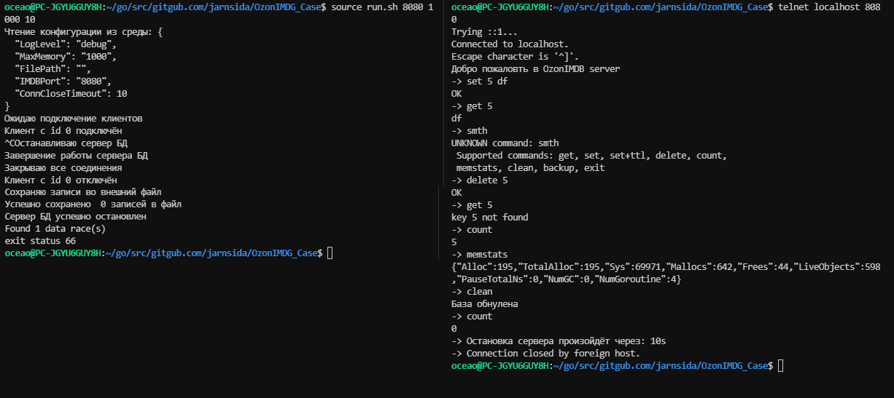

Simple IMDG service for Ozon Fintech internship

## `DB Features`

- set key 
- get key 
- delete key
- count number of DB elements
- memstats
- clean DB
- backup (save JSON to file)
- manage client connections
- warn clients before closing
- backup memory records before exiting

## `How to Test`

#### `server`
```bash
source run.sh
```

#### `client`
```bash
telnet localhost 8080

# set a key in memory db
set key val

# get a key from the memory db
get key

# delete a key from the memory db
delete key

# count shows number of db elements
count

# clean nil db
clean

# backup saves db to file as JSON
backup

# memstats shows allocaed memory
memstats

#exit disconnect user
exit
```


## :scroll: Задача    
### Написать реализацию простого in-memory key-value хранилища (аля redis).
Требования:
- [X] Возможность добавить, искать и удалять произвольный набор байт по ключу
- [X] консистентность при параллельных запросах к хранилищу
- [X] соблюдение ограничения на размер базы (по объему, задаваемый из конфига)
- [X] тестовый пример: клиент, пишущий и читающий из хранилища
____
Далее по возможности/желанию можно развить работу:
- [ ] сделать бенчмарк
- [ ] добавить поддержку TTL для ключей
- [X] добавить поддержку персистентности, чтобы хранилище переживало рестарт
- [ ] добавить поддержку типов
- [X] добавить поддержку репликации
    * etc    
    
## :clipboard: 1 этап решения

- [X] TCP(telnet) server launch
- [X] Users connect/act/disconect
- [X] Data consistency (Mutex)
- [X] Graceful Shutdown with data backup 
- [X] set/get/delete/count operations defined for [string]string
- [ ] соблюдение ограничения на размер базы (по объему, задаваемый из конфига)
- [ ] тестовый пример: клиент, пишущий и читающий из хранилища

## 2 этап решения

- Рефакторинг для более эффектиной работы TTL и элементов разних типов.
- Автоматический клиент с заданными пармаетрами подключений и запросов

## Запуск работы программы
```
source run.sh (PORT) (MAX_VOLUME) (TIMEOUT)
````

